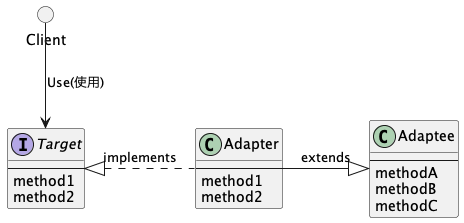

# Adapter パターン
「すでに提供されているもの」と「必要なもの」とのズレを埋めるようなデザインパターン。  
既存のクラスに一皮かぶせて必要なクラスを作る。Wrapperパターンとも言われる。  

Adapterパターンには2種類ある
- クラスによるAdapterパターン（継承）
- インスタンスによるAdapterパターン（委譲）

Goには継承が無いのでEmbeddedやInterfaceを使うことになる。

# UML

## 登場人物
- Target: 必要となっているメソッドを定める役目
- Client: Targetのメソッドを使用するクライアント
- Adaptee: 適合される側。すでに用意（提供）されているコード。サンプルでいうBannerクラス
- Adapter: 適合する側。AdapteeをTargetに適合するようにするのが目的。サンプルでいうPrintBanner

## 継承のパターン

## 委譲のパターン

# 使い所
- バージョンアップなど互換性を保ちたいときに便利。
  - 新しいバージョンをAdaptee、古いバージョンをTargetとして新バージョンのコードを適合させる。（新バージョンだけメンテナンスしたければAdapteeだけイジればOK）
- 既存のクラス（Adaptee）には一切手を加えないためプログラムチェックが楽。Adapterがちゃんと実装されていればOK。
- すでにあるクラスを新しいインターフェース（API）に適合させるとき、既存のクラスを修正するのではなく、既存のクラスに手を加えずに目的のインターフェース（API）に合わせることができないか考えてみる。
