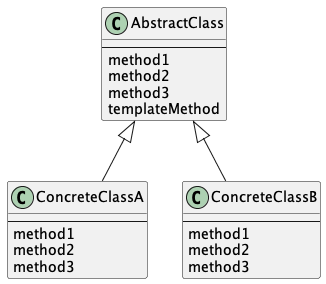

# Template Method パターン
スーパークラスで処理の枠組みを定め、サブクラスで具体的な内容を定めるパターン。

スーパークラスにテンプレートとなるメソッドが定義されており、このメソッドの中では抽象メソッドが使われている。  
抽象メソッドを実際に実装するのはサブクラス。  
異なるサブクラスで異なる実装をしたら処理内容も異なるが、処理の流れはスーパークラスの抽象メソッドで組み立てた通りになる。

これまたGoには継承がないのでこんな感じになるのかなーで書いてみたけど良い感じにならなかった

# UML

